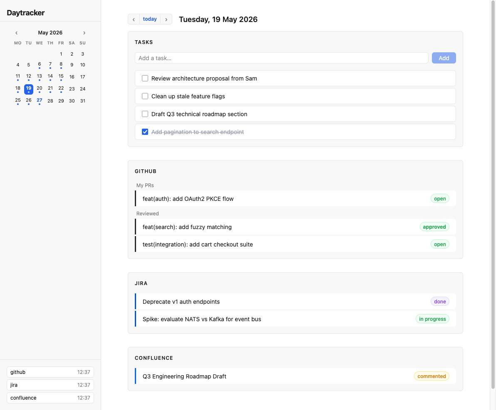
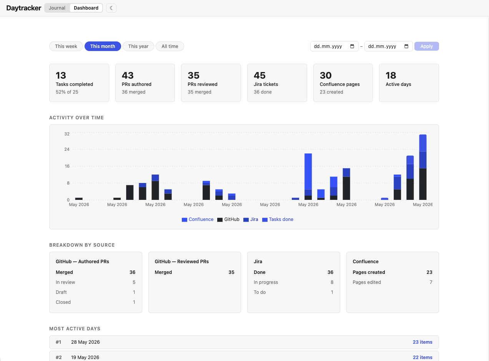

# daytracker

A single-binary daily work tracker. It embeds a Preact frontend and syncs activity from external sources (GitHub, Jira, Confluence) into a local SQLite database.




## Features

- **Day-by-day activity log** — browse any date and see everything you did across all connected sources in one place
- **GitHub** — pull requests you authored, reviewed, or commented on; PR statuses (draft → open → in review → approved → merged) kept fresh in the background
- **Jira** — issues assigned to you that were updated on the day
- **Confluence** — pages you created, edited, or commented on
- **Full-text search** — a search bar in the top bar lets you search across all activity and tasks with autocomplete; filter by source (GitHub, Jira, Confluence, or tasks only)
- **Dashboard** — a dedicated view with stat cards, a stacked bar chart of activity over time, per-source breakdowns, and your most active days; supports preset periods (this week / month / year / all time) and a custom date range
- **Background sync** — a worker fetches fresh activity on a configurable interval and backfills recent history on startup
- **Single binary** — the Preact frontend is embedded; no separate web server or database process required
- **Markdown backup** — optionally mirrors every day to a `YYYY/MM/DD.md` file tree (tasks + activity, with links) that you can commit to a notes repo or open in any editor
- **Local-first** — all data is stored in a single SQLite file on your machine; no cloud account needed
- **Raycast integration** — add tasks to today's list from the Raycast launcher without opening the app

## Install

### Docker (no dependencies required)

Requires [Docker](https://docs.docker.com/get-docker/) and [Docker Compose](https://docs.docker.com/compose/).

```bash
git clone https://github.com/aleksmaksimow/daytracker.git
cd daytracker
cp .env.example .env
$EDITOR .env
docker compose up -d
```

Open `http://localhost:8080`. The database is stored in `./data/daytracker.db` on the host — it persists across container restarts and rebuilds.

To stop:

```bash
docker compose down
```

To rebuild after a code change:

```bash
docker compose up -d --build
```

### Build from source

Requires [Go 1.22+](https://go.dev/dl/) and [Node.js 18+](https://nodejs.org/).

```bash
git clone https://github.com/aleksmaksimow/daytracker.git
cd daytracker
cd web && npm install && cd ..
make build
```

This produces a `./daytracker` binary with the frontend embedded — no separate web server needed.

Move it somewhere on your `PATH` so you can run it from anywhere:

```bash
sudo mv daytracker /usr/local/bin/daytracker
```

### Development mode

Requires [Go 1.22+](https://go.dev/dl/) and [Node.js 18+](https://nodejs.org/).

```bash
git clone https://github.com/aleksmaksimow/daytracker.git
cd daytracker
cd web && npm install && cd ..

# Terminal 1 — Go API server
make dev-api

# Terminal 2 — Vite dev server with HMR (proxies /api to :8080)
make dev-web
```

Open `http://localhost:5173`.

### Development with devenv

Requires [devenv](https://devenv.sh/) and [Nix](https://nixos.org/).

```bash
git clone https://github.com/aleksmaksimow/daytracker.git
cd daytracker
devenv up
```

This starts the Go API server and the Vite dev server in a single command, with auto-reload on file changes. Open `http://localhost:5173`. The repository also provides the following scripts:

```bash
devenv shell build  # build server + frontend
devenv shell test   # run all tests
devenv shell check  # connector health check
```

## Running

```bash
# Copy and fill in your credentials
cp .env.example .env
$EDITOR .env

# Start the server
./daytracker
```

Open `http://localhost:8080`.

## Verify connector credentials

```bash
make check
```

Reads your `.env` and pings each configured connector. Useful for confirming credentials before starting the server.

## Configuration

All configuration is via environment variables prefixed with `DAYTRACKER_`.

| Variable | Default | Description |
|---|---|---|
| `DAYTRACKER_PORT` | `8080` | HTTP port the server listens on |
| `DAYTRACKER_DB_PATH` | `./daytracker.db` | Path to the SQLite database file |
| `DAYTRACKER_SYNC_INTERVAL` | `15m` | How often the worker fetches fresh activity from all connectors |
| `DAYTRACKER_STATUS_REFRESH_INTERVAL` | `5m` | How often open PR statuses are re-checked |
| `DAYTRACKER_BACKFILL_DAYS` | `14` | Number of past days to sync on startup and to keep refreshing statuses for |
| `DAYTRACKER_BACKUP_DIR` | _(unset)_ | Directory to write daily `YYYY/MM/DD.md` snapshots; backup is disabled when unset |

## Connectors

Connectors are enabled automatically when their required variables are set. Unconfigured connectors are silently skipped.

### GitHub

Uses the [GitHub GraphQL API](https://docs.github.com/en/graphql) with a personal access token.

**Required variables:**

| Variable | Description |
|---|---|
| `DAYTRACKER_GITHUB_TOKEN` | A GitHub personal access token |

**How to create a token:**
1. Go to <https://github.com/settings/tokens> → **Generate new token (classic)**
2. Select scopes: `repo`, `read:user`
3. Copy the token and set it as `DAYTRACKER_GITHUB_TOKEN`

**What it syncs:**
- Pull requests you authored, created on the target date
- Pull requests you reviewed or commented on, updated on the target date (your own PRs are excluded from this list)

PR statuses (open, draft, in review, approved, changes requested, merged, closed) are refreshed every `DAYTRACKER_STATUS_REFRESH_INTERVAL` for PRs within the `DAYTRACKER_BACKFILL_DAYS` window.

---

### Jira

Uses the [Jira REST API v3](https://developer.atlassian.com/cloud/jira/platform/rest/v3/) with HTTP Basic Auth.

**Required variables:**

| Variable | Description |
|---|---|
| `DAYTRACKER_JIRA_BASE_URL` | Your Atlassian cloud base URL, e.g. `https://your-org.atlassian.net` |
| `DAYTRACKER_JIRA_EMAIL` | The email address of the Atlassian account |
| `DAYTRACKER_JIRA_TOKEN` | An Atlassian API token |

**How to create an API token:**
1. Go to <https://id.atlassian.com/manage-profile/security/api-tokens>
2. Click **Create API token**, give it a name, copy the value
3. Set it as `DAYTRACKER_JIRA_TOKEN`

The same token works for both Jira and Confluence — it is scoped to your Atlassian account, not to a specific product.

**What it syncs:**
- Issues assigned to you that were updated on the target date

---

### Confluence

Uses the [Confluence REST API v1](https://developer.atlassian.com/cloud/confluence/rest/v1/) with HTTP Basic Auth. The same Atlassian API token used for Jira works here.

**Required variables:**

| Variable | Description |
|---|---|
| `DAYTRACKER_CONFLUENCE_BASE_URL` | Your Atlassian cloud base URL, e.g. `https://your-org.atlassian.net` |
| `DAYTRACKER_CONFLUENCE_EMAIL` | The email address of the Atlassian account |
| `DAYTRACKER_CONFLUENCE_TOKEN` | An Atlassian API token (same token as Jira) |

See the [Jira connector](#jira) section for instructions on creating an API token.

**What it syncs:**
- Pages you created or edited on the target date (`contributor = currentUser()`)
- Pages you commented on — multiple comments on the same page are grouped into one activity item

---

## Markdown backup

Set `DAYTRACKER_BACKUP_DIR` to any directory and daytracker will write a snapshot for each synced day:

```
<backup-dir>/
  2025/
    05/
      27.md
      28.md
```

Each file contains your tasks (as a checklist) and your activity grouped by source, with titles linked to their original URLs. Files are overwritten on every sync and also refreshed every 2 minutes so task completions land quickly.

The directory is plain text — you can commit it to a notes repo, open it in Obsidian or any Markdown editor, or feed individual day files directly to an AI assistant to answer questions like "what did I work on last Tuesday?" or "summarise my Jira activity this week".

## Search

A search bar is always visible in the top bar. Start typing to get an autocomplete dropdown of up to 15 matching activity items and tasks from across all your data.

- **Filter by source** — use the dropdown to the left of the input to limit results to a specific connector (GitHub, Jira, Confluence) or to tasks only
- **Keyboard navigation** — use ↑ / ↓ to move through results, Enter to select, Escape to close
- Selecting a result navigates the Journal to the day the item was recorded

Search is powered by SQLite FTS5 with prefix matching, so partial words work (searching "auth" will match "authentication").

## Dashboard

Switch to the Dashboard view using the **Journal / Dashboard** toggle in the top bar.

The dashboard shows a summary of your productivity across a selected time period:

- **Stat cards** — tasks completed (with completion rate), PRs authored and reviewed, Jira tickets, Confluence pages, and active days
- **Activity over time** — a stacked bar chart showing GitHub, Jira, Confluence, and task activity; granularity adjusts automatically (daily for ≤60 days, weekly for ≤365 days, monthly beyond that)
- **Breakdown by source** — per-kind counts for each connector (e.g. authored merged vs open vs draft PRs, Jira done vs in progress)
- **Most active days** — your top 5 days by total activity volume

**Period selection:** use the preset chips (This week / This month / This year / All time) or enter a custom date range and click Apply.

## Contributing a connector

Want to add support for a new service? See [docs/connectors.md](docs/connectors.md) for a full walkthrough of the connector interface, kind naming conventions, frontend wiring, and test patterns.

## Raycast integration

The `raycast-scripts/` directory contains a [Raycast](https://raycast.com) script command that lets you add tasks to today's list directly from the Raycast launcher.

**Setup:**

1. Open Raycast → **Settings → Extensions → Script Commands**
2. Click **Add Directories** and select the `raycast-scripts/` folder in this repo
3. Search for **"Add Daytracker Todo"** in Raycast

**Usage:**

Invoke the command, type your task title, and hit Enter. A notification confirms the task was added. Daytracker must be running for the command to work.

By default the script posts to `http://localhost:8080`. If you've changed `DAYTRACKER_PORT`, export it in your shell environment and the script will pick it up.
